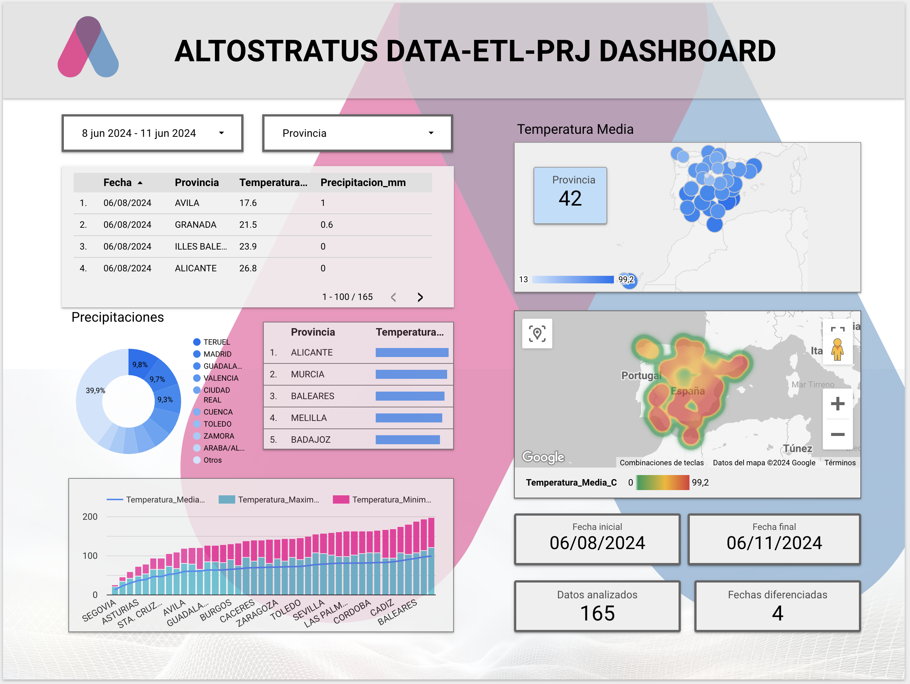
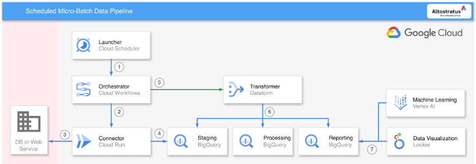

# Altostratus ETL Data Pipeline

Plan detallado de implementación de la arquitectura de extracción, carga y transformación (ELT) desde la API de AEMET.



### Descripción General
Este proyecto de Terraform está diseñado para automatizar el despliegue y la gestión de recursos en Google Cloud Platform para procesos ETL y otras tareas relacionadas con la gestión de datos. Incluye módulos para la creación de recursos de BigQuery, Cloud Scheduler, y funciones de Cloud, entre otros.

### Scope

| **Propiedad**   | **Detalle**                                                                                    |
|-----------------|------------------------------------------------------------------------------------------------|
| **API**         | AEMET OpenData                                                                                 |
| **URL Base**    | [opendata.aemet.es](https://opendata.aemet.es/dist/index.html#/informacion-satelite)           |
| **Endpoint**    | `/api/valores/climatologicos/diarios/datos/fechaini/{fechaIniStr}/fechafin/{fechaFinStr}/estacion/{idema}` |
| **Descripción** | Extrae datos climatológicos diarios de todas las estaciones para un rango de fechas específico.|
| **Método**      | GET                                                                                            |
| **Parámetros**  | `fechaIniStr`, `fechaFinStr`: Fecha de inicio y fin en formato YYYY-MM-DD.<br>`idema`: Código de la estación meteorológica. |
| **Uso**         | Utilizado en el Connector para extraer datos necesarios para procesamiento en Staging.         |

### Recursos de GCP Utilizados

| Recurso GCP       | Descripción                                                | Módulo Asociado    |
|-------------------|------------------------------------------------------------|--------------------|
| BigQuery          | Gestión de grandes datasets y ejecución de queries SQL.    | `bigquery`         |
| Cloud Functions   | Ejecución de código en respuesta a eventos. Contiene los scripts y las dependencias de la función. | `etl/connector/app`|
| Cloud Scheduler   | Automatización de scripts o llamadas HTTP.                 | `cloud_scheduler`  |
| Cloud Storage     | Almacena los archivos necesarios para las funciones de Cloud, como el código fuente y los archivos de configuración. | `etl/connector/app`|
| Cloud Run         | Escalable y sin servidor para contenedores.                | No especificado    |


## GCP Architecture



## Project Structure

```css
terraform_project/
.
├── etl
│   ├── connector
│   │   ├── main.tf
│   │   ├── variable.tf
│   │   └── app
│   │       ├── error_handling.py
│   │       ├── main.py
│   │       └── requirements.txt
│   └── transformation
│       ├── main.tf
│       ├── transformation.sql
│       └── variables.tf
├── bigquery
│   └──  main.tf
│   └──  variables.tf
├── cloud_scheduler
│   └──  main.tf
│   └──  variables.tf
└── scripts
    ├── run_etl.sh
    └── undo_etl.sh
```


## Pasos para Implementar la Arquitectura ELT


<details>
<summary><strong>Extracción, carga y transformación (ELT)</strong></summary>

### Flujo de Proceso ETL

1. **Extracción (E) - Connector:**
   - La función del connector se conecta a la API de AEMET.
   - Extrae los datos meteorológicos.
   - Almacena estos datos en la tabla de `staging` en BigQuery.

2. **Transformación (T) - Transformation:**
   - **Vista para Eliminación de Duplicados:**
     - Crea la vista `processing.aemet_data_clean_view` para eliminar duplicados.
   - **Vista para Validación y Limpieza:**
     - Crea la vista `processing.aemet_data_clean_validated_view` para validar y limpiar los datos.
   - **Tabla para Agregación y Cálculo:**
     - Crea la tabla `reporting.aemet_data_aggregated` a partir de las vistas procesadas.
     - Realiza cálculos como promedio de temperatura, suma de precipitación, etc.

3. **Carga (L) - Reporting:**
   - La tabla `reporting.aemet_data_aggregated` contiene los datos finales y agregados.
   - Estos datos están listos para ser consumidos por herramientas de visualización como Looker Studio.

</details>

## Connector

<details>
<summary><strong>Idempotence</strong></summary>
    
### Idempotencia
La idempotencia es un principio de diseño que asegura que múltiples invocaciones de una operación bajo las mismas condiciones producen el mismo resultado sin efectos adicionales. En el contexto de un conector ETL, asegura que al ejecutarse repetidas veces, el proceso no generará datos duplicados, incluso si se invoca varias veces el mismo día.

El conector está diseñado para ser idempotente. Esto se logra mediante una serie de controles y verificaciones que aseguran que solo se carguen datos nuevos o faltantes en la base de datos, sin duplicar entradas existentes. A continuación, se detallan los pasos y mecanismos utilizados:

1. **Verificación de Datos Existentes:**
   - Antes de insertar datos en BigQuery, el conector verifica si ya existen en la tabla destino. Esto se hace mediante una consulta SQL que busca registros por fecha y estación.
   ```python
   def check_data_exists(client, table_id, date, station):
       query = f"""
       SELECT COUNT(*) as count
       FROM `{table_id}`
       WHERE Fecha = '{date}' AND Estacion = '{station}'
       """
       query_job = client.query(query)
       results = query_job.result()
       for row in results:
           if row.count > 0:
               return True
       return False
   ```

2. **Procesamiento Condicional de Datos:**
   - Solo los datos que no existen actualmente en la base de datos son procesados y cargados. Esto evita duplicados y asegura que cada ejecución del conector, incluso repetida en el mismo día, no altere los resultados de las cargas anteriores.
   ```python
   for row in data:
       if not check_data_exists(client, table_id, row['Fecha'], row['Estacion']):
           unique_data.append(row)

   if unique_data:
       errors = client.insert_rows_json(table_id, unique_data)
       if errors:
           raise Exception(f"Failed to insert rows: {errors}")
   ```

3. **Manejo de Excepciones y Errores de Conectividad:**
   - Cualquier fallo en la obtención de datos o en la respuesta de la API resulta en la captura de estos incidentes sin reintentar automáticamente la carga, lo que podría llevar a intentos duplicados de inserción.
   ```python
   except requests.exceptions.RequestException as e:
       print(f"Exception occurred for station {station_id}, logging failed request: {e}")
       failed_stations.append(station_id)
   ```

#### Beneficios de la Idempotencia
Implementar la idempotencia en el conector ofrece múltiples beneficios, incluyendo:
- **Consistencia de Datos**: Asegura que los datos sean consistentes y confiables, libres de duplicaciones no deseadas.
- **Robustez Operativa**: Mejora la robustez del sistema al manejar fallos y reinvocaciones sin introducir anomalías en los datos.
- **Optimización de Recursos**: Reduce el uso innecesario de recursos al evitar procesar y almacenar datos que ya están presentes.
  
</details>


<details>
<summary><strong>Self Healing</strong></summary>

# Self Healing

La auto-reparación en nuestro conector de Altostratus asegura que si ocurre alguna interrupción en la disponibilidad de la API de AEMET, como un período de inactividad de dos semanas, el sistema automáticamente recupera y carga los datos perdidos una vez que la API vuelve a estar disponible.

#### Mecanismo de Auto-Reparación:

1. **Registro de Solicitudes Fallidas:**
   - Si una solicitud a la API falla, el incidente se registra en una tabla específica (`FAILED_REQUESTS_TABLE`) con detalles como la fecha de inicio, la fecha de fin y el código de la estación.
   ```python
   def log_failed_requests(client, start_date, end_date, station_id):
       table_id = os.getenv('FAILED_REQUESTS_TABLE_ID')
       row = {"FechaInicio": start_date, "FechaFin": end_date, "Estacion": station_id}
       client.insert_rows_json(table_id, [row])
   ```

2. **Reintento de Cargas Fallidas:**
   - Regularmente se revisa la tabla de solicitudes fallidas para intentar nuevamente cargar los datos. Si la API vuelve a estar disponible y los datos pueden ser recuperados, se procesan y cargan en BigQuery.
   ```python
   def retry_failed_requests(client, api_key):
       table_id = os.getenv('FAILED_REQUESTS_TABLE_ID')
       failed_requests = client.query(f"SELECT * FROM `{table_id}`").result()
       for request in failed_requests:
           data_url = fetch_aemet_data(api_key, request.FechaInicio, request.FechaFin, request.Estacion)
           if data_url:
               data = fetch_data_from_url(data_url)
               load_data_to_bigquery(data)
               delete_failed_request(client, request.FechaInicio, request.FechaFin, request.Estacion)
   ```

3. **Limpieza de Registros de Fallos:**
   - Después de una carga exitosa, las entradas correspondientes en la tabla de solicitudes fallidas se eliminan para evitar reintento innecesarios y mantener la tabla limpia.
   ```python
   def delete_failed_request(client, start_date, end_date, station_id):
       table_id = os.getenv('FAILED_REQUESTS_TABLE_ID')
       client.query(f"DELETE FROM `{table_id}` WHERE FechaInicio = '{start_date}' AND FechaFin = '{end_date}' AND Estacion = '{station_id}'")
   ```

#### Beneficios:

- **Continuidad y Completitud de Datos**: Asegura que todos los datos necesarios sean recuperados y cargados, manteniendo la integridad y completitud del conjunto de datos.
- **Resiliencia Operativa**: Aumenta la capacidad del sistema para manejar interrupciones sin intervención humana, mejorando la fiabilidad del proceso ETL.
- **Eficiencia en la Gestión de Datos**: Optimiza el manejo de datos y recursos al automatizar la recuperación de datos tras fallos de conexión con la fuente.

</details>


<details>
<summary><strong>Transformer</strong></summary>

### Descripción del Transformer

El módulo Transformer es crucial para la conversión de datos crudos en información agregada y limpia que se almacena para el análisis y reporte final. Este proceso se realiza mediante scripts SQL que manipulan y transforman datos almacenados en BigQuery, siguiendo un flujo detallado y estructurado de operaciones.

#### Proceso de Transformación Detallado:

1. **Eliminación de Duplicados:**
   - Primero, se crea una vista en BigQuery que elimina los duplicados de los datos recopilados, garantizando que cada registro en el dataset `staging` sea único. Esto se logra utilizando la cláusula `SELECT DISTINCT`.
   ```sql
   CREATE OR REPLACE VIEW processing.aemet_data_clean_view AS
   SELECT DISTINCT *
   FROM staging.aemet_data;
   ```

2. **Validación y Limpieza de Datos:**
   - A continuación, se aplica una segunda vista para validar y limpiar los datos. Esta vista filtra los registros para asegurarse de que todos los campos críticos contengan valores válidos y no nulos, como temperaturas y precipitaciones.
   ```sql
   CREATE OR REPLACE VIEW processing.aemet_data_clean_validated_view AS
   SELECT *
   FROM processing.aemet_data_clean_view
   WHERE Temperatura_Media_C IS NOT NULL
     AND Temperatura_Maxima_C IS NOT NULL
     AND Temperatura_Minima_C IS NOT NULL;
   ```

3. **Agregación y Cálculo:**
   - Finalmente, se realiza una transformación que agrega los datos por provincia y fecha, calculando promedios y totales para varias métricas climáticas. Esta transformación se almacena como una tabla en el dataset `reporting`.
   ```sql
   CREATE OR REPLACE TABLE reporting.aemet_data_aggregated AS
   SELECT Provincia, Fecha,
          AVG(Temperatura_Media_C) AS Avg_Temperatura_Media_C,
          AVG(Temperatura_Maxima_C) AS Avg_Temperatura_Maxima_C,
          AVG(Temperatura_Minima_C) AS Avg_Temperatura_Minima_C,
          SUM(Precipitacion_mm) AS Total_Precipitacion_mm,
          AVG(Humedad_Relativa_Media) AS Avg_Humedad_Relativa_Media,
          AVG(Presion_Maxima_hPa) AS Avg_Presion_Maxima_hPa,
          AVG(Presion_Minima_hPa) AS Avg_Presion_Minima_hPa,
          AVG(Velocidad_Media_Viento_ms) AS Avg_Velocidad_Media_Viento_ms,
          MAX(Racha_Maxima_Viento_ms) AS Max_Racha_Maxima_Viento_ms
   FROM processing.aemet_data_clean_validated_view
   GROUP BY Provincia, Fecha;
   ```

#### Características Clave del Transformer:

- **Automatización de Limpieza y Validación:** Asegura la calidad y la confiabilidad de los datos que fluyen hacia los sistemas de reporting y análisis.
- **Eficiencia de Consultas:** Al almacenar vistas intermedias y tablas, se minimiza el costo computacional de futuras consultas y análisis, permitiendo un acceso más rápido y eficiente a los datos.
- **Facilidad de Mantenimiento:** Mantener el código SQL en archivos separados y bien documentados facilita su revisión y actualización.

</details>


<details>
<summary><strong>Machine Learning</strong></summary>

# Predictions

### Parámetros Clave en el Modelo de Machine Learning

| **Parámetro**          | **Descripción**                                                                                       | **Valor Utilizado** |
|------------------------|-------------------------------------------------------------------------------------------------------|---------------------|
| **Forecast Horizon**   | Define el período hacia el futuro para el cual el modelo realiza predicciones.                        | Después de 7 días   |
| **Context Window**     | Cantidad de días anteriores usados para predecir un valor futuro, proporcionando contexto histórico.  | 5 días              |

#### Resumen de Parámetros:
- **Forecast Horizon**: Ajustado para predecir valores hasta 7 días después del último dato disponible, enfocado en una proyección de corto plazo.
- **Context Window**: Utiliza 5 días de datos anteriores para cada predicción, equilibrando la captura de tendencias recientes sin sobrecargar el modelo con información demasiado antigua.

## Primera predicción

```
Fecha,Estacion,Provincia,Temperatura_Maxima_C,Temperatura_Minima_C,Humedad_Relativa_Media,Presion_Maxima_hPa,Presion_Minima_hPa,Velocidad_Media_Viento_ms,Racha_Maxima_Viento_ms,Precipitacion_mm,predicted_on_Fecha,Predicted_Temperatura_Media_C
2024-06-11,"MADRID, RETIRO",MADRID,30.0,20.0,45.0,937.2,933.9,2.5,7.8,0.0,2024-06-11,24.859983444213867
2024-06-12,"MADRID, RETIRO",MADRID,31.0,21.0,46.0,937.2,933.9,2.5,7.8,0.0,2024-06-11,24.525007247924805
2024-06-13,"MADRID, RETIRO",MADRID,32.0,22.0,47.0,937.2,933.9,2.5,7.8,0.0,2024-06-11,24.2839412689209
2024-06-14,"MADRID, RETIRO",MADRID,33.0,23.0,48.0,937.2,933.9,2.5,7.8,0.0,2024-06-11,24.024276733398438
2024-06-15,"MADRID, RETIRO",MADRID,34.0,24.0,49.0,937.2,933.9,2.5,7.8,0.0,2024-06-11,24.142459869384766
2024-06-16,"MADRID, RETIRO",MADRID,35.0,25.0,50.0,937.2,933.9,2.5,7.8,0.0,2024-06-11,24.18337059020996
2024-06-17,"MADRID, RETIRO",MADRID,36.0,26.0,51.0,937.2,933.9,2.5,7.8,0.0,2024-06-11,24.358701705932617
```

## Segunda prediccion
```
"2024-06-11","MADRID","30.0","20.0","0.0","45.0","937.2","933.9","2.5","7.8",22.91298484802246
"2024-06-12","MADRID","31.0","21.0","0.0","46.0","937.2","933.9","2.5","7.8",22.82161521911621
"2024-06-13","MADRID","32.0","22.0","0.0","47.0","937.2","933.9","2.5","7.8",22.551820755004883
"2024-06-14","MADRID","33.0","23.0","0.0","48.0","937.2","933.9","2.5","7.8",22.6556396484375
"2024-06-15","MADRID","34.0","24.0","0.0","49.0","937.2","933.9","2.5","7.8",22.755218505859375
"2024-06-16","MADRID","35.0","25.0","0.0","50.0","937.2","933.9","2.5","7.8",22.822126388549805
"2024-06-17","MADRID","36.0","26.0","0.0","51.0","937.2","933.9","2.5","7.8",22.743627548217773
```

## Analisis

### Mejoras para el segundo modelo

- **Ampliación de Datos**: El segundo modelo se benefició de un conjunto de datos mucho más amplio, aprovechando observaciones de un año entero por cada estación. Esto proporcionó una base más robusta para el entrenamiento, permitiendo al modelo captar mejor las variabilidades y tendencias a largo plazo.
- **Tiempo de Entrenamiento**: Al duplicar el tiempo de entrenamiento en el segundo modelo, se permitió un análisis más profundo de los datos más extensos, potencialmente mejorando la capacidad del modelo para hacer predicciones precisas.
- **Tratamiento de Valores Nulos**: Optar por la mediana en lugar de la media para reemplazar los valores nulos en las precipitaciones asegura que el modelo no se vea afectado por valores atípicamente altos o bajos, manteniendo una aproximación más realista y representativa de las condiciones climáticas típicas.

### Parámetros Clave en el Modelo de Machine Learning

| **Parámetro**          | **Descripción**                                                                                       | **Valor Utilizado** |
|------------------------|-------------------------------------------------------------------------------------------------------|---------------------|
| **Forecast Horizon**   | Define el período hacia el futuro para el cual el modelo realiza predicciones.                        | Después de 7 días   |
| **Context Window**     | Cantidad de días anteriores usados para predecir un valor futuro, proporcionando contexto histórico.  | 5 días              |

#### Resumen de Parámetros:
- **Forecast Horizon**: Ajustado para predecir valores hasta 7 días después del último dato disponible, enfocado en una proyección de corto plazo.
- **Context Window**: Utiliza 5 días de datos anteriores para cada predicción, equilibrando la captura de tendencias recientes sin sobrecargar el modelo con información demasiado antigua.

### Modelo de ayer
- **MAE (Error Absoluto Medio)**: 4.296
- **MAPE (Error Porcentual Absoluto Medio)**: 391,988,900 (extremadamente alto)
- **RMSE (Error Cuadrático Medio Raíz)**: 5.187
- **RMSLE (Error Logarítmico Cuadrático Medio Raíz)**: 0.559
- **R² (Coeficiente de Determinación)**: 0.301

### Modelo de hoy
- **MAE**: 3.25
- **MAPE**: 64,606,156 (todavía muy alto pero mucho menor que el modelo anterior)
- **RMSE**: 4.206
- **RMSLE**: 0.343
- **R²**: 0.571
- **RMSPE (Error Porcentual Cuadrático Medio Raíz)**: 1,027,265,200 (muy alto)
- **WAPE (Error Porcentual Absoluto Ponderado)**: 19.869

### Análisis y Comparación

1. **MAE y RMSE**:
   - El MAE y RMSE son más bajos en el modelo de hoy, lo que indica que, en promedio, los errores en las predicciones son menores en magnitud comparado con el modelo de ayer.

2. **MAPE y RMSPE**:
   - Ambos modelos presentan valores extremadamente altos para MAPE y RMSPE, lo que sugiere que hay problemas en algunos casos específicos donde los errores porcentuales son muy grandes. Esto podría ser debido a valores reales muy pequeños o cercanos a cero, lo cual hace que cualquier error pequeño en la predicción se amplifique en términos porcentuales.

3. **RMSLE**:
   - El RMSLE es más bajo en el modelo de hoy, indicando que este modelo maneja mejor los errores en una escala logarítmica, lo cual es útil cuando los valores varían en órdenes de magnitud.

4. **R²**:
   - El valor de R² es sustancialmente mayor en el modelo de hoy (0.571 frente a 0.301), lo que sugiere que este modelo puede explicar una mayor proporción de la varianza de los datos observados, lo que lo hace más fiable.

5. **WAPE**:
   - WAPE solo está disponible para el modelo de hoy y es relativamente alto (19.869), lo que indica que el error medio ponderado es casi el 20% del valor real promedio.

### Conclusión

El **modelo de hoy es más fiable** en términos generales, ya que todas las métricas clave de error (MAE, RMSE, RMSLE) son más bajas, y su R² es mucho más alto, lo que significa que el modelo de hoy tiene una mejor capacidad general para predecir los datos. Sin embargo, ambos modelos sufren de altos errores porcentuales (MAPE, RMSPE), lo que puede necesitar una revisión de cómo los datos son manejados o transformados antes de la predicción, o podría indicar que el modelo necesita ser ajustado para manejar mejor casos con valores pequeños o cero.

</details>

<details>
<summary><strong>Dashboard</strong></summary>

### Dashboard en Looker Studio

El dashboard en Looker Studio visualiza datos de clima procesados y almacenados en la BigQuery de reporting. Está diseñado para ofrecer insights dinámicos y actualizados con una interfaz interactiva y fácil de navegar.

#### Características del Dashboard:
- **Filtros Dinámicos**: Incluye filtros de fecha y localización que permiten a los usuarios personalizar la visualización de datos desde el 06/08/2024 al 11/06/2024 y por provincias específicas.
- **Fuentes de Datos**: Se alimenta directamente de la tabla de reporting en BigQuery, asegurando que los datos sean actuales y reflejen las últimas actualizaciones y transformaciones realizadas.
- **Visualizaciones Implementadas**:
  - **Tabla de Datos**: Muestra registros diarios de temperatura y precipitaciones por provincia.
  - **Mapa de Calor**: Representa la temperatura media a nivel provincial, permitiendo una visualización geográfica de los datos.
  - **Gráficos de Barras y Tortas**: Proporcionan análisis comparativos de la temperatura (media, máxima, mínima) y distribuciones porcentuales de las precipitaciones entre diferentes provincias.

#### Beneficios del Dashboard:
- **Interactividad**: Los usuarios pueden interactuar con los filtros para explorar diferentes aspectos de los datos climáticos, adaptando el análisis a sus necesidades específicas.
- **Actualización en Tiempo Real**: Conectado directamente a BigQuery, el dashboard refleja cambios y actualizaciones de datos en tiempo real.
- **Soporte Decisorio**: Facilita la toma de decisiones proporcionando un acceso rápido y fácil a insights climáticos clave, esenciales para planificación y respuesta a condiciones ambientales.

</details>

## Thanks

Agradecimientos al equipo de Altostratus por poner a nuestra disposicion los conceptos y herramientas necesarias para llevar a cabo este proyecto.


[Pablo Palma Rodríguez](https://www.linkedin.com/in/pablopalmarodr%C3%ADguez/)
